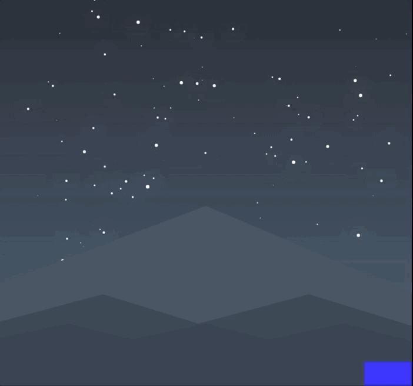

## [StarScape](https://jkern-dev.github.io/StarScape/)

## Install
``` bash
npm install
npm run webpack
```

Place the index.html file path into your browser

* [StarScape](https://jkern-dev.github.io/StarScape/) is a game built using HTML Canvas and Javascript. While stars fall from above, you must navigate your alien to avoid being hit. Be careful as the stars bounce and are still dangerous until they shatter entirely! 



## Stars and Physics
* Every star is generated to fall at different directions, with a velocity assignment for their movement across the X and Y axis of the canvas display. When a star is detected to hit the bottom of the screen its Y velocity is flipped and multiplied by a friction force that reduces its speed. 

* When a star does make contact the shatter effect is called which creates the effect of a stars reduction in size upon contact with the ground. When shatter() is called the stars radius is reduced and a collection of miniature stars will shatter from its originating star. While these stars are not dangerous to the character, they are built utilizing similarly to a star object but are not considered in determining if a collision with the character has been made!

``` javascript
update() {
    this.draw();
    // hit bottom of screen flip velocity
    if (this.y + this.radius + this.vel.y >= this.gameHeight - this.game.groundHeight) {
      this.vel.y = - this.vel.y  * this.friction;
      this.shatter();
    } else { 
      this.vel.y += this.gravity;
    }
    this.x += this.vel.x;
    this.y += this.vel.y;
  }

  shatter() {
    this.radius -= 3;
    this.shadowBlur = this.shadowBlur / 2;
    for (let i = 0; i < 8; i++) {
      this.game.miniStars.push(new Ministar(this.c, this.x, this.y, 2, this.game))
    }
  }
```

## Randomly Generating Stars to fall
* To create random stars, a spawn value is randomly determined and if it is entirely divisible by a ticker that updates with each animation update a new star is created. 

``` javascript
this.ticker ++
    // randomize when a new star is spawned and falls from the sky
    if (this.ticker % this.spawn == 0) {
      const radius = 20;
      // make sure always generating star in range of canvas width
      const x = Math.max(radius, Math.random() * this.gameWidth - radius);
      this.stars.push(new Star(this, x, -100, 20, '#E3EAEF'))
      this.spawn = util.randomIntFromRange(50,200);
    }
```
